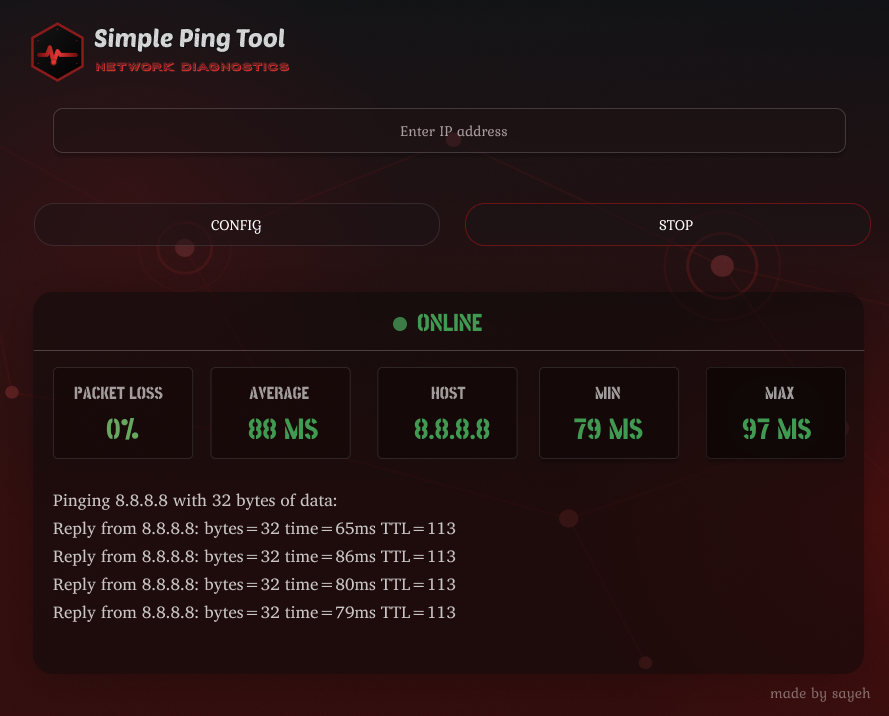
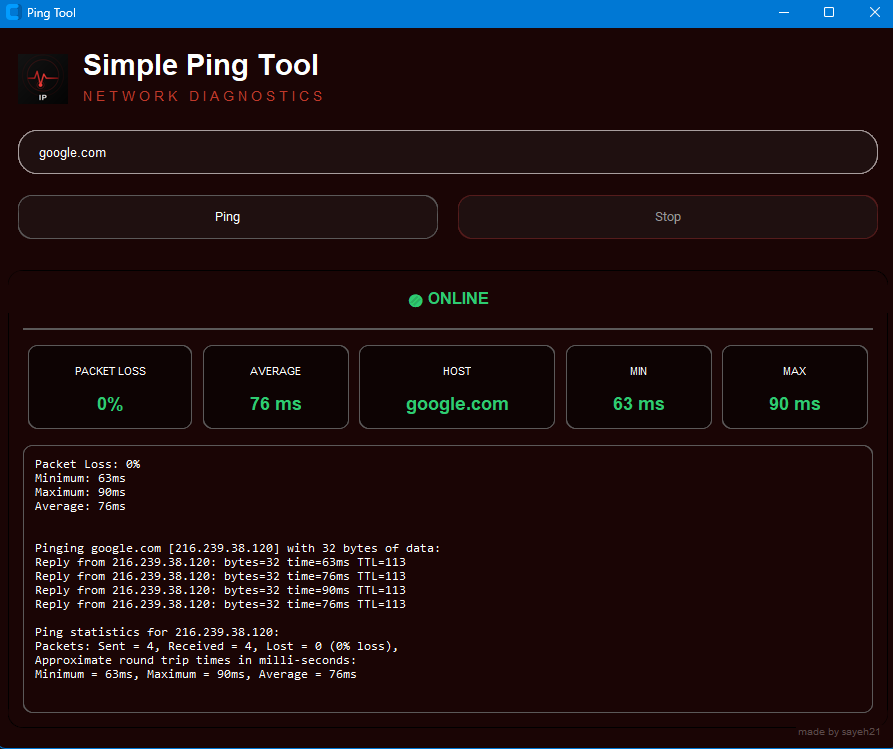

# 🔴 Simple Ping Tool

A simple desktop GUI application for checking IP address or domain connectivity, built with **Python** and **CustomTkinter**. Featuring a sleek dark UI with real-time ping results.

## Design

Designed in Figma, then built with Python and CustomTkinter.

| Figma Design | Final App |
|---|---|
|  |  |

## ✨ Features

- 📡 Ping any **IP address or domain**
- 🔄 **Real-time**, live ping output (line-by-line)
- 📊 Live stats: **packet loss, average, min, and max latency**
- ✅ Input validation for IPv4/IPv6 addresses and domain names
- ⏹️ **Stop** an ongoing ping at any time
- 🎨 Modern dark red/black themed UI

## 🛠️ Built With

- [Python](https://www.python.org/)
- [CustomTkinter](https://github.com/TomSchimansky/CustomTkinter) — modern UI widgets
- [Pillow](https://python-pillow.org/) — image handling
- `subprocess` + `threading` — running ping without freezing the UI

## 📦 Requirements

- Python 3.10+
- CustomTkinter
- Pillow

## 🚀 Installation

```bash
git clone https://github.com/Sayeh21/Simple_ping_tool.git
cd Simple_ping_tool
pip install -r requirements.txt
```

## ▶️ Usage

```bash
python Simple_Ping_Tool.py
```

Enter an IP address or domain (e.g. `8.8.8.8` or `google.com`) and click **Ping** to start. Click **Stop** to cancel an ongoing ping at any time.

## 📁 Project Structure

Simple_ping_tool/
├── Simple_Ping_Tool.py
├── icon.png
├── ping.png
├── figma_design.png
└── README.md
## ⚠️ Note

Currently tested on **Windows**. On Linux/macOS, the ping command flag may need to be changed from `-n` to `-c`.

## 👤 Author

Made by **Sayeh21**